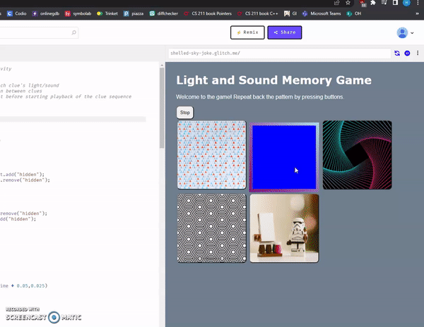
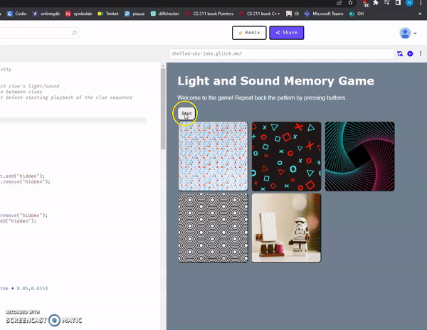

# Pre-work - *Memory Game*

**Memory Game** is a Light & Sound Memory game to apply for CodePath's SITE Program. 

Submitted by: Hamza Ali

Time spent: 8 hours spent in total

Link to project: (insert your link here, should start with https://shelled-sky-joke.glitch.me/)

## Required Functionality

The following **required** functionality is complete:

* [X] Game interface has a heading (h1 tag), a line of body text (p tag), and four buttons that match the demo app
* [X] "Start" button toggles between "Start" and "Stop" when clicked. 
* [X] Game buttons each light up and play a sound when clicked. 
* [X] Computer plays back sequence of clues including sound and visual cue for each button
* [X] Play progresses to the next turn (the user gets the next step in the pattern) after a correct guess. 
* [X] User wins the game after guessing a complete pattern
* [X] User loses the game after an incorrect guess

The following **optional** features are implemented:

* [X] Any HTML page elements (including game buttons) has been styled differently than in the tutorial
* [ ] Buttons use a pitch (frequency) other than the ones in the tutorial
* [X] More than 4 functional game buttons
* [ ] Playback speeds up on each turn
* [ ] Computer picks a different pattern each time the game is played
* [ ] Player only loses after 3 mistakes (instead of on the first mistake)
* [X] Game button appearance change goes beyond color (e.g. add an image)
* [ ] Game button sound is more complex than a single tone (e.g. an audio file, a chord, a sequence of multiple tones)
* [ ] User has a limited amount of time to enter their guess on each turn

The following **additional** features are implemented:

- [ ] List anything else that you can get done to improve the app!

## Video Walkthrough (GIF)

If you recorded multiple GIFs for all the implemented features, you can add them here:

## Reflection Questions
1. If you used any outside resources to help complete your submission (websites, books, people, etc) list them here. 
The websites I used to help me complete the optional choices is freecodecamp and w3schools

2. What was a challenge you encountered in creating this submission (be specific)? How did you overcome it? (recommended 200 - 400 words) 

While going through the required steps, the guide was very easy to understand and easy to follow so I did not have any trouble getting through. However, with the optional portion of the prework, getting the image into the assets in glitch did not work of getting any image to be used no matter how many types of images I used. So, another method I used was a background image of a url which fixes the issue of getting a background image for the button. How I was able to overcome this was first I look up on the issue with the assets and how I can get it to work. After looking into it, it seems to be more of a technical issue from their side so I could do much about the assets issues I am having. Afterwards, I investigate another approach of using which was using an image’s url instead of downloading and import the image into the glitch. Though this method does work, it is also a risk because anything can happen to the links to where the link would not be available to access when it gets removed from where it originally came from. For the borders to have a gradient look when the button is activated, I did not know how to do that, so I searched up how to it. It took a few tries until I got the result I was looking for.

3. What questions about web development do you have after completing your submission? (recommended 100 - 300 words) 

The questions I have about web development is first, will we be using API during the internship and if so, what data will we be using and how will it be used? Second, what are the major concepts of web development that will be covering during the internship? Third, when making a website, how would you officially make your own website that anyone is about to search up and interact with as well as being able be active for years? Finally, when creating a design for your own website, rather than using others pre-existing designs, how can you create your own original designs?

4. If you had a few more hours to work on this project, what would you spend them doing (for example: refactoring certain functions, adding additional features, etc). Be specific. (recommended 100 - 300 words) 

If I have a few more hours to work on this project, I will try to fix some issues that the required does not cover. One would be when disabling the user from pressing the button while it is displaying the next button to press because if you try pressing the buttons while it’s displaying the next button, then it messes up the game and becomes hard to know what buttons to press. Another one I would do is give random patterns instead of the same patterns repeatedly to make the game more interesting. Lastly, I would want to make a scoreboard to see how far the user can get without failing and saves the user’s best score so far.

## Interview Recording URL Link

[My 5-minute Interview Recording](https://www.loom.com/share/71b6fc04f891453789c96053f715f700)

## License

    Copyright [Hamza Ali]

    Licensed under the Apache License, Version 2.0 (the "License");
    you may not use this file except in compliance with the License.
    You may obtain a copy of the License at

        http://www.apache.org/licenses/LICENSE-2.0

    Unless required by applicable law or agreed to in writing, software
    distributed under the License is distributed on an "AS IS" BASIS,
    WITHOUT WARRANTIES OR CONDITIONS OF ANY KIND, either express or implied.
    See the License for the specific language governing permissions and
    limitations under the License.
